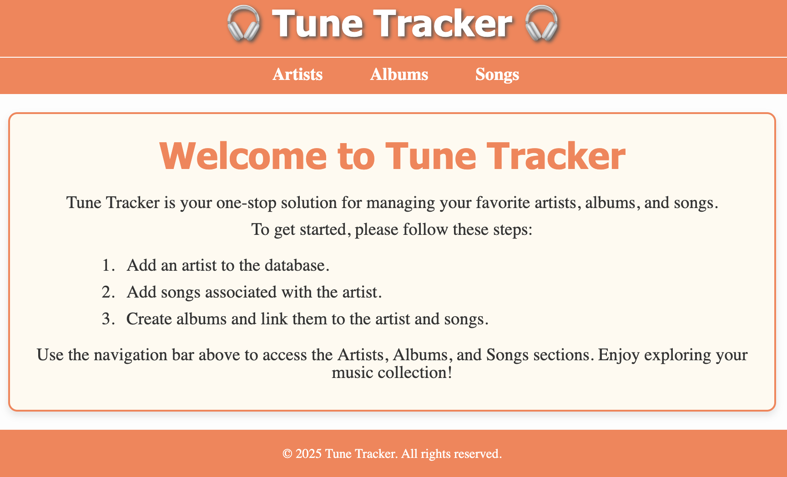

# Tune Tracker React Web App

A modern React web application for managing your music library. Tune Tracker allows you to organize your favorite songs, albums, and artists in one place.



## Table of Contents

- [Overview](#overview)
- [Features](#features)
- [System Architecture](#system-architecture)
- [Prerequisites](#prerequisites)
- [Installation](#installation)
- [Configuration](#configuration)
- [Usage](#usage)
  - [Local Development](#local-development)
  - [Production Build](#production-build)
  - [Page Usage](#page-usage)
    - [Artists](#artists)
    - [Songs](#songs)
    - [Albums](#albums)
- [Development](#development)
- [Contributing](#contributing)
- [License](#license)
- [Authors](#authors)

## Overview

Tune Tracker is a full-stack web application that helps music enthusiasts organize and manage their music library. The application consists of two main components:

1. **Frontend**: A React-based web application (this repository)
2. **Backend**: A Spring Boot API server (see [Tune Tracker API](https://github.com/yourusername/Tune-Tracker-API))

## Features

- **Song Management**: Add, edit, and delete songs with details like title, artist, album, and release date
- **Artist Management**: Create and manage artist profiles with name, bio, and genre information
- **Album Management**: Organize your albums with title, artist, release date, and genre
- **Responsive Design**: Works seamlessly on desktop devices
- **Modern UI**: Clean and intuitive interface with a focus on user experience

## System Architecture

Tune Tracker follows a client-server architecture:

- **Frontend**: React.js application that provides the user interface
- **Backend**: Spring Boot REST API that handles data persistence and business logic
- **Database**: MySQL database for storing application data

### Backend Options

You have two options for setting up the backend:

#### Option 1: Run the Tune Tracker API locally

1. Clone the Tune Tracker API repository:

   ```
   git clone https://github.com/yourusername/Tune-Tracker-API.git
   ```

2. Follow the setup instructions in the [Tune Tracker API README](https://github.com/yourusername/Tune-Tracker-API/blob/main/README.md)

3. Make sure the backend server is running before starting the frontend application

#### Option 2: Use the hosted API

If you prefer not to run the backend locally, you can use the hosted API:

1. Update the API base URL in the frontend configuration to point to the hosted API

## Prerequisites

Before you begin, ensure you have the following installed:

- **Node.js** (v14 or higher)
- **npm** or **yarn**
- **Backend server** (either local or hosted)
- **Git** (for cloning repositories)

## Installation

1. Clone the repository:

   ```
   git clone https://github.com/yourusername/Tune-Tracker-React-Web-App.git
   ```

2. Navigate to the project directory:

   ```
   cd Tune-Tracker-React-Web-App
   ```

3. Install dependencies:
   ```
   npm install
   ```

## Configuration

Before running the application, you need to configure the API endpoint:

1. Open `.env.production` (or create new similar configuration file)
2. Update the `API_BASE_URL` to point to your backend server:
   - For local development: `http://localhost:8080/`
   - For hosted API: `http://<hosted-api-url>:80` - where <hosted-api-url> is your API endpoint.

## Usage

### Local Development

To run the application in development mode:

```
npm start
```

This will start the development server and open the application in your default browser at http://localhost:3000. Any changes you make to the code will automatically reload the page.

### Production Build

To create and test a production build:

1. Build the application:

   ```
   npm run build
   ```

   This creates an optimized production build in the `build` folder.

2. Install a static server (if not already installed):

   ```
   npm install -g serve
   ```

3. Serve the production build:

   ```
   serve -s build
   ```

4. Open your browser and visit the URL shown in the terminal (typically http://localhost:3000)

### Page Usage

Due to the relationships implemented in the backend API, songs, artists, and albums must be added in a certain order:

- Artists have no relationship to other entities, thus can be simply added without errors.
- A song must have an artist, otherwise it isn't a valid song (add artist first).
- An album must have an artist and a list of valid songs (add artist and songs first).

#### Artists

**Add (POST):**

1. Navigate to the Artists section
2. Fill in the artist details (name, bio, genre, etc.)
3. Click the "Add Artist" button to add an artist
4. If valid, the artist will be stored in the database and shown on the page

**Edit (PUT):**

1. Click the "Edit" button below the respective artist to edit it
2. Fill in the fields and choose "Update Artist" or "Cancel edit"

**Delete (DELETE):**

1. Click the "Delete" button below the respective artist
2. Confirm deletion when prompted

#### Songs

**Add (POST):**

1. Navigate to the Songs section
2. Fill in the song details (title, genre, etc.)
3. Click the "Add Song" button to add a song
4. If valid, the song will be stored in the database and shown on the page

**Edit (PUT):**

1. Click the "Edit" button below the respective song to edit it
2. Fill in the fields and choose "Update Song" or "Cancel edit"

**Delete (DELETE):**

1. Click the "Delete" button below the respective song
2. Confirm deletion when prompted

#### Albums

**Add (POST):**

1. Navigate to the Albums section
2. Fill in the album details (title, artist, release date, genre, etc.)
3. Click the "Add Album" button to add an album
4. If valid, the album will be stored in the database and shown on the page

**Edit (PUT):**

1. Click the "Edit" button below the respective album to edit it
2. Fill in the fields and choose "Update Album" or "Cancel edit"

**Delete (DELETE):**

1. Click the "Delete" button below the respective album
2. Confirm deletion when prompted

## Development

To run the application in development mode:

```
npm start
```

This will start the development server and open the application in your default browser at http://localhost:3000. Any changes you make to the code will automatically reload the page.

## Contributing

1. Fork the repository
2. Create your feature branch (`git checkout -b feature/amazing-feature`)
3. Commit your changes (`git commit -m 'Add some amazing feature'`)
4. Push to the branch (`git push origin feature/amazing-feature`)
5. Open a Pull Request

## License

This project is provided for personal use only. Redistribution, modification, or commercial use in any form is strictly prohibited without prior written permission from the author.
For detailed license terms, refer to the [LICENSE](./LICENSE.md) file.

## Authors

- **[Adam-S988](https://github.com/Adam-S988)**
- **[BJamesShea](https://github.com/BJamesShea)**
- **[Nasser-A-Ali](https://github.com/Nasser-A-Ali)**
- **[sarwoodford](https://github.com/sarwoodford)**
- **[SearchingSteve](https://github.com/SearchingSteve)**
